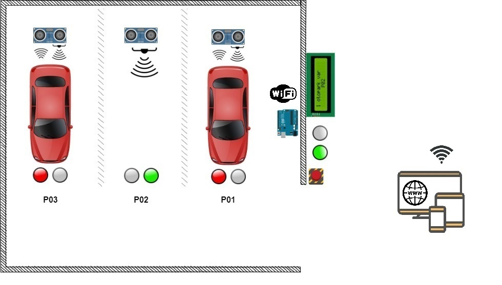
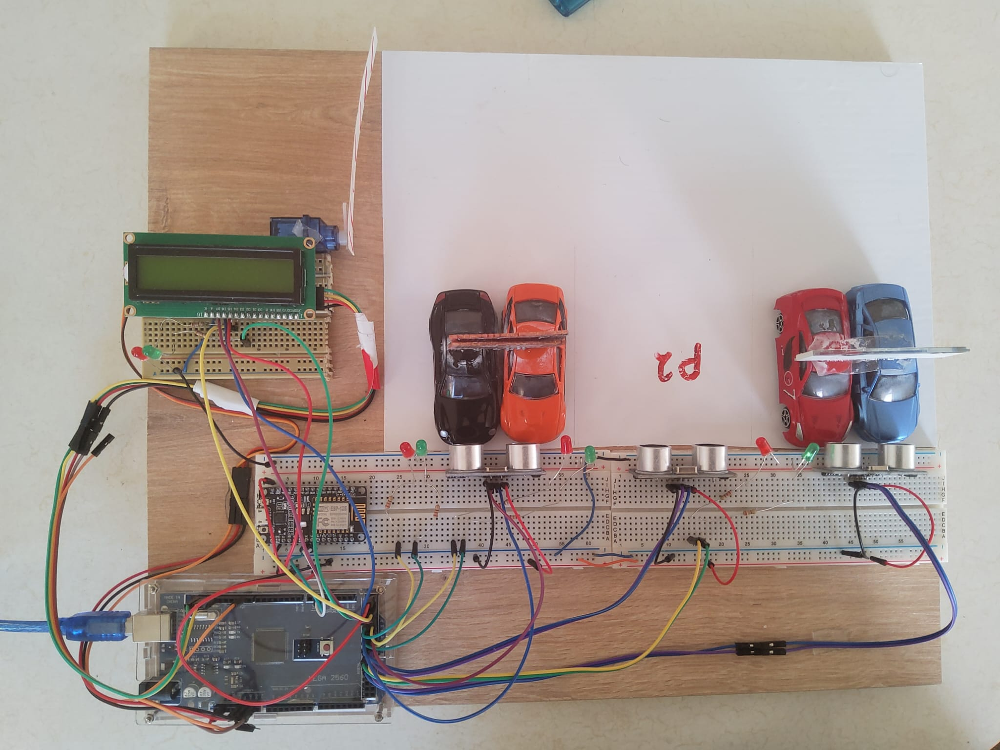

# Parking Guidance System

The recent technological developments accompanied by economic changes have made affording an automobile easier and consequently led to a rapid increase in their numbers. Simultaneously, the usage of parking lots has increased. This increase is also concentrated due to people's tendency to populate certain small areas for different factors. For instance, in 2014 alone, 4 million cars parked in the ISPARK parking lot in the Fatih district/Istanbul. Usually, drivers do not directly find available parking spots and spend on average 7.8 to 10 minutes searching for them. Additionally, in large car parks, the driver might confront difficulties in finding the location of their parked car. This problem has adverse economic, environmental, and psychological effects. In the USA, the annual average time loss per driver during this process is 17 hours. Every time it costs a driver in France or the UK 1.42 Euro. The resulting emissions of CO2, CO, HC, and NOx are respectively 398.71, 19.90, 3.29, and 21.14 g/s/vehicle.

## The Design

As a solution to this problem, a prototype Parking Guidance System has been developed through the following stages. A conceptual design that addresses the system’s objectives, functions, guidance levels, and main components was prepared. The main criterion was to design a system that is more economical, less complex, flexible, scalable, and possible to improve while being acceptably efficient.

### System Components

- **Controller:** Arduino Mega (ATmega2560)
- **Sensors:** Ultrasonic sensors
- **Communication:** NodeMcu 12E (ESP8266) for Wi-Fi communication
- **User Interface:** Blynk IoT platform
- **Indicators:** Red and green LEDs, and an LCD 16x2

[Here](./drawings/fritzing/components-list.md) is the detailed list of the components.

The flow charts, block, pictorial, and schematic diagrams is used to describe the system processes, physical components, wiring, and their interactions. The code is written in Arduino IDE – C++ and preceded by flow charts that show all the functions and decision trees in the system software. Before successfully implementing the system, it was partially tested in a simulation environment, [Proteus](./drawings/proteus/) and [Wokwi](https://wokwi.com/projects/333014911768592980).

#### System Block Diagram

#### System Flow Chart

### Prototype Details

The prototype contains:

- 3 parking spaces with lamps
- A gate with a screen
- A website and an application through an IoT platform

The driver can see which spots are available in the parking lot through the screen, the app, and the website. While inside, they will be guided through the green lamps. Once the car is parked, the name (ID) of the car is assigned to the filled space. The ID can be chosen by the user through the Internet user interface (UI), otherwise, it would be chosen automatically by the system. Later the driver can locate his car by searching on the UI using the ID.

### Wiring

#### Pictorial Diagram

#### Schematics - wires

#### Schematics - nodes

### Future Improvements

- **Environmental Adaptation:** Sensors working with signals other than sound waves might be added to the already used sensors.
- **Automatic ID Registration:** Installing a plate reader on the gates to register the car number as its ID.
- **Enhanced Algorithm:** Improving the algorithm that assigns the car ID to the filled space for more accurate results.
- **User Interface Development:** Expanding the Internet user interface to include more features that benefit users on both sides, the owner, and the consumer.
- **City-Wide Guidance:** Integrating the system into a more comprehensive platform to guide the driver in larger areas, such as a whole city.
- **AI Integration:** Using AI algorithms to provide predictions about parking space availability and analyze user behavior.

### Ethical Considerations

The huge flow of data in automation processes dealing directly with consumers comes with the risk of violating user privacy. Therefore, adhering to ethical standards and legal regulations is essential for user rights. The implementation of these requirements should be observed and assured by the legal authorities.

## References

1. İSPARK, «Otoparklar her gün yoğun,» 6 Ocak 2015. [Çevrimiçi]. Available: [İspark](https://ispark.istanbul/)
2. O. Dokur, S. Katkoori and N. Elmehraz, «Embedded system design of a real-time parking guidance system,» Annual IEEE Systems Conference (SysCon), pp. 1-8, 2016.
3. Nandyal, Suvarna, Sabiya Sultana, and Sadaf Anjum., «Smart car parking system using arduino uno.,» International Journal of Computer Applications, no. 169.1, pp. 13-18, 2017.
4. Varan, Metin, and Ceylan Karakuş., «Sakarya şehri için dış ve iç yönlendirmeli rezervasyon tabanlı otopark yönetim sistemi tasarımı ve sistem başarımı,» Sakarya Üniversitesi Fen Bilimleri Enstitüsü Dergisi, cilt 1, no. 22, pp. 66-74, 2018.
5. P. D. M. Öztürk, «Otopark planlamasız şehirleşme olmaz,» 28 Şubat 2020. [Çevrimiçi]. Available: [Indyturk](https://www.indyturk.com/)
6. Dogaroglu, Bora, S. Pelin Caliskanelli, and Serhan Tanyel, «Comparison of intelligent parking guidance system and conventional system with regard to capacity utilisation.,» Sustainable Cities and Society, cilt 74, p. 103152, 2021.
7. Zhou, Fengli and Li, Qing, «Parking Guidance System Based on ZigBee and Geomagnetic Sensor Technology,» 2014 13th International Symposium on Distributed Computing and Applications to Business, Engineering and Science, pp. 268-271, 2014.
8. S.-e. Y. e. al, «PGS: Parking Guidance System based on wireless sensor network,» 2008 3rd International Symposium on Wireless Pervasive Computing, pp. 218-222, 2008.
9. H. V. Jaurkar, G. N. Mulay and V. Gohokar, «Parking guidance system using Internet of Things,,» International Conference on Inventive Computation Technologies (ICICT), cilt 1, pp. 1-6, 2016.
10. Huang, K. Y. and Chang, S. B. and Tsai, P. R., «The advantage of the arduino sensing system on parking guidance information systems,» 2017 IEEE International Conference on Industrial Engineering and Engineering Management (IEEM), Cilt %1 / %22078-2082, 2017.

## License

